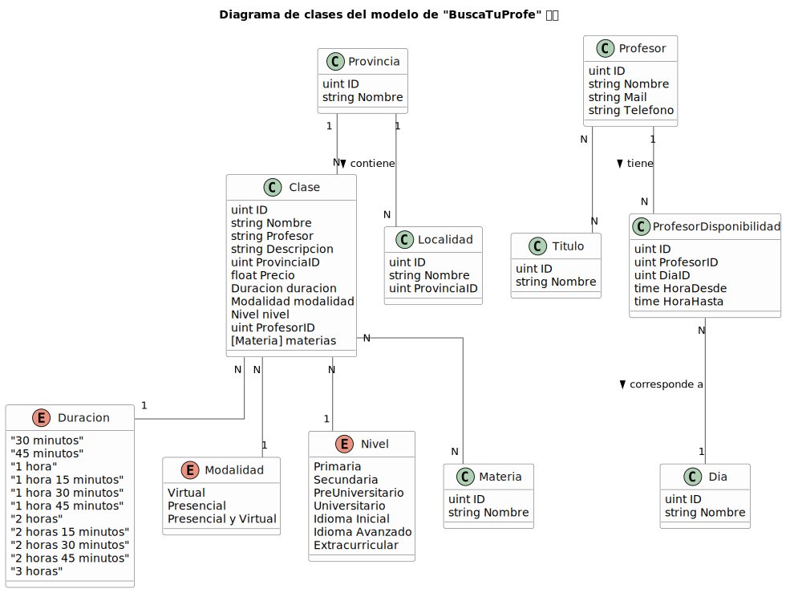

# MODELOS DEL SISTEMA


## ENUMS
### Duracion
```
type Duracion string
const (
	Duracion30 Duracion = "30 minutos"
    ...
)
```

### Modalidad
```
type Modalidad string
const (
	Virtual Modalidad = "Virtual"
    ...
)
```

### Nivel
```
type Nivel string
const (
	Universitario Nivel = "Universitario"
    ...
)
```
